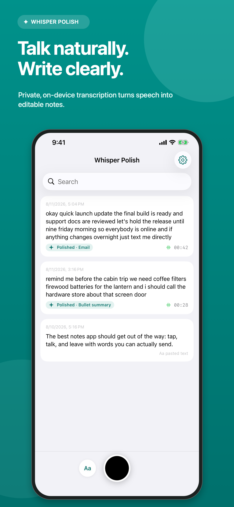
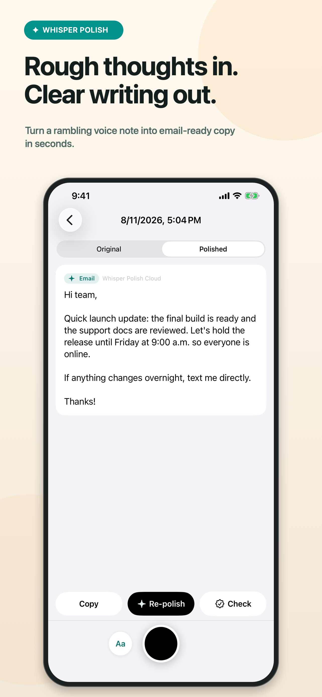
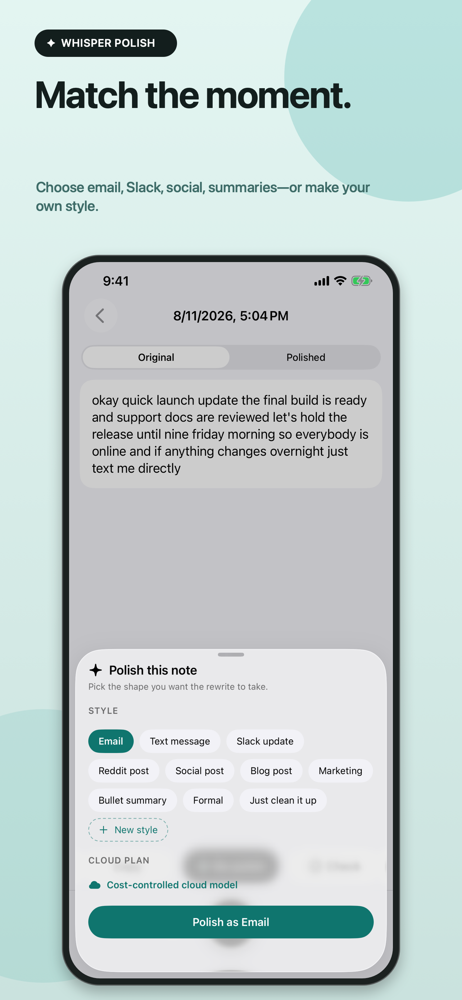
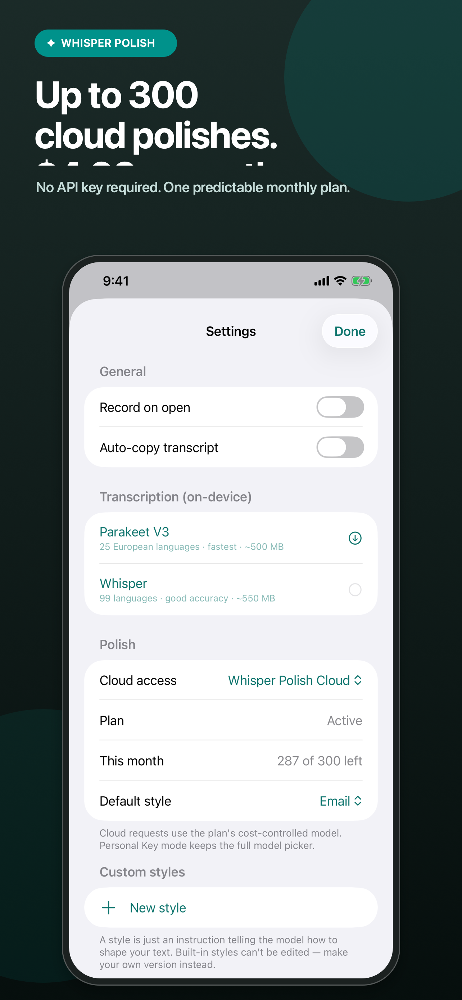
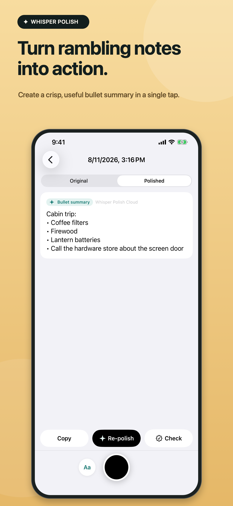

<p align="center">
  
</p>

<h1 align="center">Whisper Polish</h1>

<p align="center">
  <strong>Talk naturally. Leave with words you can actually send.</strong>
</p>

<p align="center">
  A free, open-source iPhone app that transcribes voice notes on-device,<br>
  then rewrites them in the style you choose.
</p>

<p align="center">
  <a href="#why-whisper-polish">Why Whisper Polish</a> ·
  <a href="#choose-how-you-polish">Personal Key or Cloud</a> ·
  <a href="#build-it">Build it</a> ·
  <a href="https://yallware.com/whisper-polish/">Website</a> ·
  <a href="SECURITY.md">Security</a>
</p>

<p align="center">
  
  
  
</p>

<p align="center">
  
  
</p>

## Why Whisper Polish

Most transcription apps stop at a wall of spoken text. Whisper Polish keeps the speed and personality of a voice note, then removes the filler, false starts, and repetition that make it hard to send.

- **Private by default.** Recording and transcription happen on your iPhone.
- **Your voice, cleaned up.** Built-in styles cover email, text, Slack, summaries, and more; custom styles let you describe exactly how you want to sound.
- **Originals stay intact.** The transcript and polished version live together in the same local note.
- **No account required.** Use your own OpenRouter key or opt into the hosted Cloud plan.
- **Useful beyond rewriting.** Personal Key mode can fact-check notes with live web search.

## Choose how you polish

Whisper Polish is free. AI rewriting is deliberately offered in two straightforward modes:

| | Personal Key | Whisper Polish Cloud |
|---|---|---|
| Setup | Add your OpenRouter API key | Subscribe in the app |
| Billing | Pay OpenRouter directly | $4.99/month through Apple |
| Included use | Based on your OpenRouter balance | Up to 300 cloud polishes per billing period |
| Request path | iPhone → OpenRouter | iPhone → Whisper Polish API → OpenRouter |
| Key storage | iOS Keychain | No provider key required |
| Account | No Whisper Polish account | No Whisper Polish account |

Cloud is optional. Recording, on-device transcription, note storage, and Personal Key mode do not require a subscription.

## Under the hood

The iOS app is written in SwiftUI and stores notes locally with SwiftData. It supports Parakeet and Whisper transcription models, keeps OpenRouter credentials in Keychain, and uses StoreKit 2 for the optional subscription.

The Cloud service is a small TypeScript/Fastify API. Each request carries an App Store-signed transaction; the server verifies the entitlement and enforces the plan allowance without introducing a separate Whisper Polish account or login.

```text
Voice or typed note
        │
        ├── on-device transcription ── local SwiftData note
        │
        ├── Personal Key ───────────── OpenRouter
        │
        └── Cloud subscription ─────── entitlement check ── OpenRouter
```

## Build it

You need macOS with Xcode 26 or newer and [XcodeGen](https://github.com/yonaskolb/XcodeGen) 2.45 or newer.

```sh
git clone https://github.com/jonclegg/whisper-polish.git
cd whisper-polish
brew install xcodegen
xcodegen generate
xcodebuild \
  -project WhisperPolish.xcodeproj \
  -scheme WhisperPolish \
  -destination 'platform=iOS Simulator,name=iPhone 17 Pro' \
  test
```

[`project.yml`](project.yml) is the source of truth; the generated Xcode project is intentionally ignored. Swift package versions are pinned so clean checkouts resolve the same dependencies.

The included [`WhisperPolish.storekit`](WhisperPolish.storekit) configuration provides a local version of the monthly product for StoreKit testing. A distribution build needs the matching App Store Connect product:

```text
com.jonclegg.WhisperPolish.cloud.monthly
```

### Configure the Cloud API

Personal Key mode talks directly to OpenRouter and does not need this service. For subscription builds, supply the production HTTPS base URL when archiving:

```sh
xcodebuild \
  -project WhisperPolish.xcodeproj \
  -scheme WhisperPolish \
  WHISPER_POLISH_API_BASE_URL=https://api.example.com \
  archive
```

See [`backend/README.md`](backend/README.md) for local development and production configuration.

## Repository map

| Path | What lives there |
|---|---|
| [`WhisperPolish/`](WhisperPolish/) | SwiftUI app, models, services, and views |
| [`Tests/`](Tests/) | iOS unit tests and opt-in integration tests |
| [`backend/`](backend/) | StoreKit-verifying Cloud API |
| [`AppStore/`](AppStore/) | Store metadata and reproducible screenshot assets |
| [`deploy/`](deploy/) | Containerized production deployment |
| [`project.yml`](project.yml) | Reproducible XcodeGen project definition |

## Contributing

Issues and pull requests are welcome. Keep changes focused, include tests when behavior changes, and never commit API keys, App Store Connect credentials, database credentials, or production environment files.

Please report security issues privately as described in [`SECURITY.md`](SECURITY.md).

## License

Whisper Polish is released under the [Apache License 2.0](LICENSE). Third-party packages and downloaded model weights remain subject to their own licenses.
